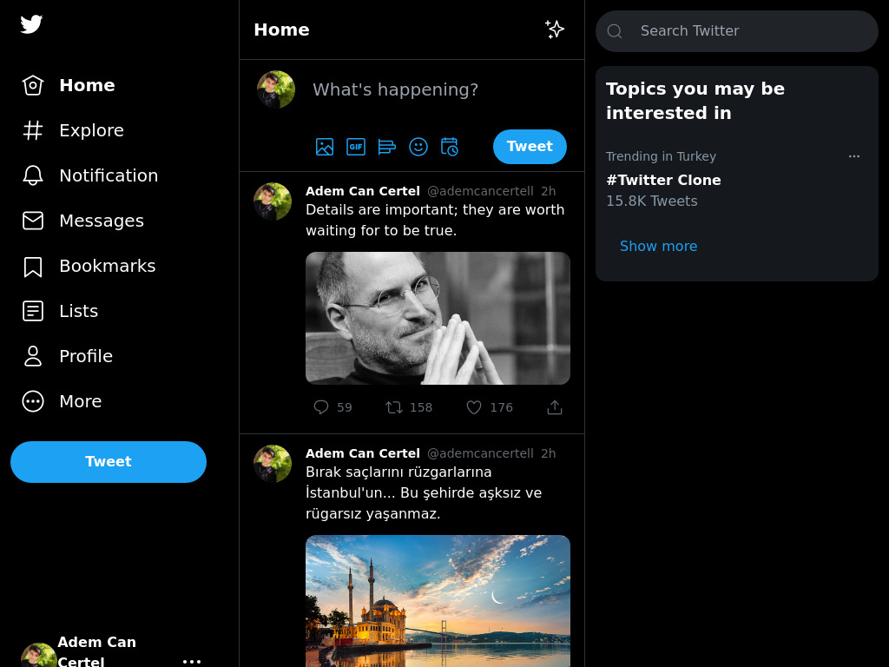

## Twitter Clone 🐦

## Getting Started
  To add the project to your device.
  - `git clone git@github.com:AdemCanCertel/twitter.git`

  Then install the project
  - `npm install` & `yarn`

  after installing the project, you can start it in developer mode.
  - `npm run dev` & `yarn dev`

### Todo List 
  - [ ] Message Box 
  - [ ] Completing the pages 👌
  - [ ] Solving a Firebase mail error.
  - [ ] OnClick menu structures